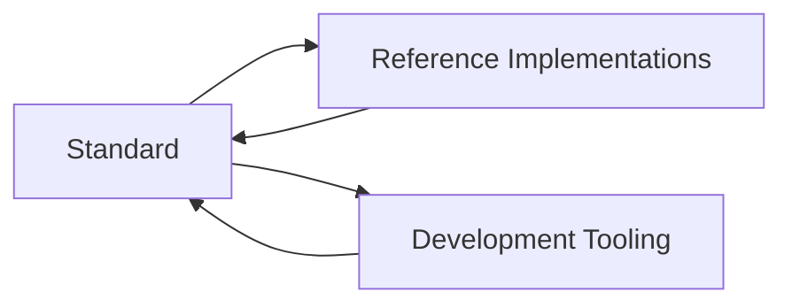

# SASD Development Standard

> An open, practical development standard for reproducible, understandable, secure, and maintainable technical projects.

[](PROJECT-STATUS.md)
[](LICENSE)
[](https://github.com/Robin-Goerlach/SASD-Development-Standard/actions/workflows/quality-gates.yml)
[](docs/40-governance/NORMATIVE-LANGUAGE.md)

## Overview

The **SASD Development Standard** defines a repeatable way to turn an idea into a maintainable technical product. It covers the complete project lifecycle rather than only source-code conventions:

- project initiation, classification, scope, and requirements,
- architecture, repository structure, and technical decisions,
- implementation quality, testing, security, and privacy,
- documentation, releases, maintenance, and archival,
- knowledge retention and responsible AI-assisted development.

The primary audience is solo developers, freelancers, open-source maintainers, administrators with development tasks, learners with professional ambitions, and small technical teams.

The central question is not only:

> How do I program this?

It is:

> How do I plan, document, implement, verify, release, operate, and maintain this project so that it remains understandable and transferable?

## Current status

| Item | State |
|---|---|
| Normative documents | **46/46 Approved** |
| Approved 0.9.0 baseline | **32 documents, 1,345 requirements** |
| Pilot size coverage | Small, Medium, and Large documented |
| Technically verified pilots | **0/3** |
| `1.0.0-rc.1` readiness | **Blocked by three open checks** |
| Current phase | Consolidation and release-evidence closure |

The repository is not yet a Release Candidate or stable Version 1.0. The current blockers are practical pilot verification, exact-commit cross-platform CI evidence, and the governed `main` ruleset decision.

Read [`PROJECT-STATUS.md`](PROJECT-STATUS.md) for the complete human-readable status. The generated [`Release Candidate Readiness`](docs/40-governance/VERSION-1.0-RELEASE-CANDIDATE-READINESS.md) remains the technical source for the current RC checks.

## Start here

Choose the path that matches your task.

### Start a new project

1. Select project size, quality level, and profiles with the [`Project Classification Process`](docs/30-processes/PROJECT-CLASSIFICATION.md).
2. Follow the [`New Project Process`](docs/30-processes/NEW-PROJECT.md).
3. Use the [`New Project Checklist`](checklists/project-initiation/NEW-PROJECT-CHECKLIST.md).
4. For a compact solo workflow, read the [`Solo Developer Guide`](docs/10-core-standard/SOLO-DEVELOPER-GUIDE.md).

### Adopt the standard in an existing project

1. Use the [`Legacy Migration Process`](docs/30-processes/LEGACY-MIGRATION.md).
2. Apply the [`Core Standard`](docs/10-core-standard/README.md).
3. For .NET, add the [`C#/.NET Profile`](docs/20-profiles/dotnet/README.md) and its [adoption checklist](checklists/project-initiation/DOTNET-PROFILE-ADOPTION-CHECKLIST.md).
4. For WinForms or WPF, also apply the [`Desktop Profile`](docs/20-profiles/desktop/README.md) and its [adoption checklist](checklists/project-initiation/DESKTOP-PROFILE-ADOPTION-CHECKLIST.md).

### Review or maintain the standard

1. Read the [`Project Status`](PROJECT-STATUS.md) and [`Roadmap`](ROADMAP.md).
2. Review the [`Project Charter`](docs/00-foundation/PROJECT-CHARTER.md), normative [`Version 1.0 Scope`](docs/00-foundation/SCOPE.md), and informative [`Scope Freeze`](docs/40-governance/VERSION-1.0-SCOPE-FREEZE.md).
3. Use the [`Governance`](docs/40-governance/README.md) and [`Reference Implementation`](docs/50-reference-implementations/README.md) areas.
4. Run the local quality gates:

```bash
python3 tooling/run-quality-gates.py
```

## Version 1.0 product boundary

Version 1.0 delivers:

- a technology-independent Core Standard,
- quality levels `Minimum`, `Recommended`, and `Production`,
- requirements, architecture, documentation, repository, quality, security, testing, release, maintenance, knowledge, and AI-assisted-development rules,
- C#/.NET and Desktop profiles,
- operational processes from project start through archival,
- templates, checklists, prompts, examples, and validation tooling,
- documented Small, Medium, and Large pilot baselines,
- reproducible release archives and stable Word/PDF publications.

Linux, database, container, Kubernetes, Web API, and advanced Security profiles are not required for Version 1.0. The approved normative boundary is defined in [`SCOPE.md`](docs/00-foundation/SCOPE.md); the current release freeze is recorded in [`VERSION-1.0-SCOPE-FREEZE.md`](docs/40-governance/VERSION-1.0-SCOPE-FREEZE.md).

## Product model

The project has three cooperating layers:



### Standard

Normative rules, profiles, processes, and governance, supported by guidance, templates, and checklists.

### Reference implementations

Real SASD projects used to test proportionality, evidence requirements, migration processes, and practical usability.

### Development tooling

Reusable repository templates, prompt packages, generators, validators, CI workflows, and release tools that help apply and verify the standard.

## Quality levels

| Level | Intended use |
|---|---|
| **SASD Minimum** | Small tools, learning projects, experiments, and prototypes |
| **SASD Recommended** | Maintained applications, public repositories, and regular SASD projects |
| **SASD Production** | Business-critical, security-sensitive, customer-facing, or operational systems |

The quality level changes the required depth and evidence, not the meaning of a requirement. Start with [`QUALITY-LEVELS.md`](docs/10-core-standard/QUALITY-LEVELS.md).

## Repository map

```text
.
├── docs/
│   ├── 00-foundation/              # Charter, scope, principles, content model
│   ├── 10-core-standard/           # Technology-independent normative core
│   ├── 20-profiles/                # .NET, Desktop, and deferred profile areas
│   ├── 30-processes/               # Project and lifecycle processes
│   ├── 40-governance/              # Approval, change, release, and compliance rules
│   ├── 50-reference-implementations/ # Pilots and repository self-hosting evidence
│   └── 90-project-history/         # Historical development records
├── templates/
├── checklists/
├── prompts/
├── examples/
├── scripts/
├── tooling/
├── artefacts/
└── .github/
```

See the [`Content Architecture`](docs/00-foundation/CONTENT-ARCHITECTURE.md) and [`Document Catalog`](docs/00-foundation/DOCUMENT-CATALOG.md) for the formal Version 1.0 document model.

## Normative language and authority

The authoritative normative edition is German. Binding keywords and document states are defined in:

- [`NORMATIVE-LANGUAGE.md`](docs/40-governance/NORMATIVE-LANGUAGE.md),
- [`DOCUMENT-LIFECYCLE.md`](docs/40-governance/DOCUMENT-LIFECYCLE.md),
- [`DOCUMENT-METADATA.md`](docs/40-governance/DOCUMENT-METADATA.md).

Only Approved normative documents are binding within a referenced standard version. README text, examples, prompts, checklists, generated views, and historical records do not silently create new requirements.

## Release Candidate preparation

The repository contains a controlled plan, blocker register, generated readiness report, draft release documents, deterministic archive builder, independent verifier, and read-only preview workflow for `1.0.0-rc.1`.

```bash
python3 tooling/run-quality-gates.py
python3 tooling/build-release-candidate.py --mode preview
python3 tooling/verify-release-candidate.py --directory artifacts/release-candidate
```

Preview mode creates no tag and publishes no release. Release mode remains blocked until the readiness checks are closed and the Maintainer decision is documented.

## SASD Prompt Package

The candidate `sasd-development-standard-v1` package contains 39 versioned prompts across nine lifecycle categories, a central variable registry, generated catalogs and checksums, schemas, deterministic packaging, and independent verification.

```bash
python3 tooling/validate-prompt-packages.py
python3 tooling/build-prompt-package.py --clean --output-dir artifacts/prompt-packages
python3 tooling/verify-prompt-package.py --directory artifacts/prompt-packages
```

The package is the canonical exchange format. Compatibility with a specific Prompt Manager build is claimed only after an exact-version import/export roundtrip has been executed successfully.

## Repository identity and safe updates

The canonical repository identity is declared in [`REPOSITORY-IDENTITY.json`](REPOSITORY-IDENTITY.json). Quality gates reject foreign project roots, nested repository copies, and unexpected top-level content.

Update packages that delete or move files must use a repository-aware script or patch. ZIP extraction alone is suitable only for purely additive overlays.

## Contributing

Contributions, reviews, pilot evidence, and experience reports are welcome. See [`CONTRIBUTING.md`](CONTRIBUTING.md).

## License

This repository is licensed under the [MIT License](LICENSE), unless a document or included third-party material states otherwise.
