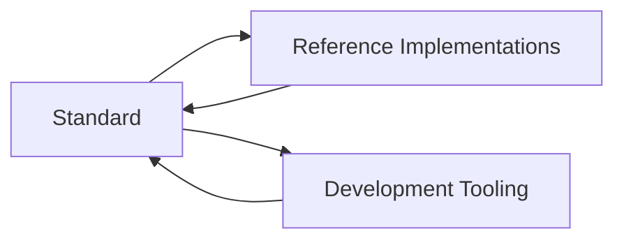

# SASD Development Standard

> An open, practical development standard for reproducible, understandable, secure, and maintainable technical projects.

[](#project-status)
[](LICENSE)
[](#language)

## Overview

The **SASD Development Standard** defines a complete and repeatable way to turn an idea into a maintainable technical product. It focuses not only on programming, but on the entire lifecycle of a project:

- project initiation and scope,
- requirements and architecture,
- repository and documentation structure,
- implementation quality,
- testing and reviews,
- security and privacy,
- releases and maintenance,
- knowledge management,
- prompt engineering and responsible AI-assisted development.

The standard is designed primarily for solo developers, freelancers, open-source maintainers, students, trainees, administrators with development tasks, and small technical teams.

## Vision

Every project created under the SASD Development Standard should remain understandable, reproducible, testable, and maintainable—even years later and by someone who did not originally create it.

Knowledge must not exist only in a developer's head, in temporary chats, or in undocumented routines.

## Core question

The standard does not primarily answer:

> How do I program?

It answers:

> How do I develop, document, test, release, operate, and maintain a professional technical project?

## Three product layers



### 1. Standard

The normative rules, principles, profiles, processes, templates, and checklists.

### 2. Reference implementations

Existing SASD projects that demonstrate how the standard is applied in practice. The first focus is the consolidation of the SASD C#/.NET codebase.

### 3. Development tooling

Reusable files and tools that help create and verify compliant projects, such as `.editorconfig`, `Directory.Build.props`, repository templates, analyzers, checks, and prompt packages.

## Quality levels

The standard uses scalable quality levels so that small utilities are not burdened with the same requirements as production systems.

| Level | Intended use |
|---|---|
| **SASD Minimum** | Small tools, learning projects, experiments, and prototypes |
| **SASD Recommended** | Maintained applications, public repositories, and regular SASD projects |
| **SASD Production** | Business-critical, security-sensitive, customer-facing, or operational systems |

## Version 1.0 scope

Version 1.0 is intended to provide a stable foundation consisting of:

- a technology-independent core standard,
- a repository and documentation model,
- project lifecycle and governance rules,
- quality levels,
- fundamental testing and security requirements,
- a C#/.NET profile,
- a desktop application profile,
- GitHub conventions,
- prompt engineering guidance,
- reusable templates and checklists,
- initial technical configuration files,
- pilot migrations of selected SASD repositories.

Detailed Linux, database, Docker, Kubernetes, and advanced security profiles are part of the long-term vision but are not required to complete Version 1.0.

## Repository structure

```text
.
├── docs/
│   ├── 00-foundation/
│   ├── 10-core-standard/
│   ├── 20-profiles/
│   ├── 30-processes/
│   ├── 40-governance/
│   └── 50-reference-implementations/
├── templates/
├── checklists/
├── prompts/
├── tooling/
├── examples/
├── artefacts/
└── .github/
```

See the [content architecture](docs/00-foundation/CONTENT-ARCHITECTURE.md) and the [Version 1.0 document catalog](docs/00-foundation/DOCUMENT-CATALOG.md) for the planned standard structure.

## Getting started

1. Read the [`Project Charter`](docs/00-foundation/PROJECT-CHARTER.md).
2. Review the [`Version 1.0 Scope`](docs/00-foundation/SCOPE.md).
3. Review the [`Content Architecture`](docs/00-foundation/CONTENT-ARCHITECTURE.md) and [`Document Catalog`](docs/00-foundation/DOCUMENT-CATALOG.md).
4. Read the rules for [`Normative Language`](docs/40-governance/NORMATIVE-LANGUAGE.md), [`Document Lifecycle`](docs/40-governance/DOCUMENT-LIFECYCLE.md), and [`Document Metadata`](docs/40-governance/DOCUMENT-METADATA.md).
5. Review the [`Core Standard`](docs/10-core-standard/README.md), starting with the [`Quality Levels`](docs/10-core-standard/QUALITY-LEVELS.md).
6. Follow the [`Roadmap`](ROADMAP.md).
7. Use the [`New Project Checklist`](checklists/project-initiation/NEW-PROJECT-CHECKLIST.md) when starting a project.
8. Record important technical decisions using the [`ADR Template`](templates/architecture-decisions/ADR-TEMPLATE.md).

## Normative language

The following terms are used intentionally:

- **MUST**: mandatory requirement,
- **SHOULD**: recommended requirement; deviations require a reason,
- **MAY**: optional practice.

The exact interpretation is defined in [`NORMATIVE-LANGUAGE.md`](docs/40-governance/NORMATIVE-LANGUAGE.md). Documents become binding only after reaching the `Approved` state defined by the document lifecycle.

## Project status

The project is currently in the **Core Standard proposal and profile-development phase**. All 13 technology-independent Core documents are available as Proposed 0.3.0 after a documented consistency and proportionality review. Proposed documents are release candidates, not yet stable Version 1.0 requirements.

Current priorities:

1. create the C#/.NET profile against the Proposed Core,
2. create the desktop application profile,
3. complete project classification and operational process documents,
4. pilot the Proposed Core on small, medium, and complex SASD projects,
5. move Foundation, Governance, Core, and profiles toward approval.

## Language

The normative pre-1.0 draft is initially written in German to allow precise development and review. An English edition is planned once the structure and terminology have stabilized.

## Contributing

The project is currently developed as a SASD reference initiative. Contributions, reviews, and experience reports are welcome. See [`CONTRIBUTING.md`](CONTRIBUTING.md).

## License

This repository is licensed under the [MIT License](LICENSE), unless a document or included third-party material states otherwise.
