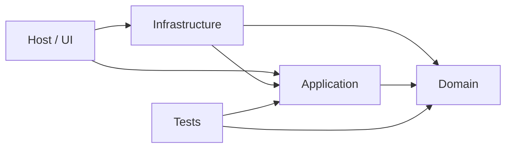

# C#/.NET Solution- und Projektstruktur

## 1. Zweck

Dieses Dokument definiert eine skalierbare Struktur für .NET-Repositories, Solutions, Projekte, Namespaces und Abhängigkeiten. Es verhindert sowohl unstrukturierte Monolithen als auch unnötige Projektfragmentierung.

## 2. Geltungsbereich

Die Regeln gelten für einzelne Bibliotheken, kleine Werkzeuge und mehrschichtige Anwendungen. Das [Sizing Guide](DOTNET-PROJECT-SIZING-GUIDE.md) zeigt drei empfohlene Ausprägungen.

## 3. Referenzstruktur

```text
.
├── src/
│   ├── Sasd.Product.Domain/
│   ├── Sasd.Product.Application/
│   ├── Sasd.Product.Infrastructure/
│   └── Sasd.Product.Host/
├── tests/
│   ├── Sasd.Product.Domain.Tests/
│   ├── Sasd.Product.Application.Tests/
│   ├── Sasd.Product.IntegrationTests/
│   └── Sasd.Product.ArchitectureTests/
├── docs/
├── tooling/
├── Directory.Build.props
├── Directory.Packages.props
├── global.json
└── Sasd.Product.sln
```

Nicht jedes Projekt benötigt alle Schichten. Die Struktur MUSS aus dem tatsächlichen Bedarf abgeleitet werden.

## 4. Normative Anforderungen

| ID | Anforderung |
|---|---|
| SASD-DOTNET-REQ-101 | Die Repository- und Solution-Struktur MUSS die fachlichen und technischen Verantwortlichkeiten verständlich abbilden. |
| SASD-DOTNET-REQ-102 | Ein Projekt DARF NICHT allein zur Erfüllung eines Schemas in mehrere Assemblies aufgeteilt werden. |
| SASD-DOTNET-REQ-103 | Eine Aufteilung in mehrere Projekte SOLLTE erfolgen, wenn getrennte Verantwortlichkeiten, Deployment-Einheiten, Wiederverwendung, Ziel-Frameworks oder Abhängigkeitsgrenzen dies rechtfertigen. |
| SASD-DOTNET-REQ-104 | Produktionscode und Testcode MÜSSEN in getrennten Projekten oder klar getrennten Buildbereichen liegen. |
| SASD-DOTNET-REQ-105 | Produktive Projekte SOLLTEN unter `src/` und Testprojekte unter `tests/` abgelegt werden. |
| SASD-DOTNET-REQ-106 | Eine Solution-Datei oder ein unterstütztes gleichwertiges Workspace-Format SOLLTE alle regulär gemeinsam gebauten Projekte enthalten. |
| SASD-DOTNET-REQ-107 | Solution- und Projektdateien MÜSSEN versioniert sein; benutzerspezifische IDE-Dateien DÜRFEN NICHT versioniert werden. |
| SASD-DOTNET-REQ-108 | Projekt- und Assemblynamen MÜSSEN eindeutig, stabil und ihrem fachlichen Zweck entsprechend benannt sein. |
| SASD-DOTNET-REQ-109 | Namespaces SOLLTEN dem Produkt- oder Organisationspräfix und der fachlichen Struktur folgen, ohne den physischen Ordnerbaum mechanisch vollständig nachzubilden. |
| SASD-DOTNET-REQ-110 | Testprojekte SOLLTEN das getestete Projekt mit einem Suffix wie `.Tests`, `.IntegrationTests` oder `.ArchitectureTests` erkennbar referenzieren. |
| SASD-DOTNET-REQ-111 | Ein Projekt MUSS seine Rolle erkennen lassen, beispielsweise Host, UI, Application, Domain, Infrastructure, Contracts oder Tests. |
| SASD-DOTNET-REQ-112 | Eine geschichtete Anwendung MUSS zulässige Abhängigkeitsrichtungen dokumentieren und technisch oder durch Reviews kontrollieren. |
| SASD-DOTNET-REQ-113 | Zirkuläre Projekt- oder Paketabhängigkeiten DÜRFEN NICHT eingeführt werden. |
| SASD-DOTNET-REQ-114 | Domänen- oder Kernlogik SOLLTE nicht von UI-, Datenbank-, Netzwerk- oder Hostingtechnologien abhängen, sofern ein eigenständiger fachlicher Kern existiert. |
| SASD-DOTNET-REQ-115 | Infrastructure-Implementierungen SOLLTEN über im Kern oder in Contracts definierte Abstraktionen angebunden werden, wenn Austauschbarkeit oder Testbarkeit einen realen Nutzen besitzt. |
| SASD-DOTNET-REQ-116 | Der Composition Root MUSS Abhängigkeiten sichtbar zusammensetzen und SOLLTE im ausführbaren Hostprojekt liegen. |
| SASD-DOTNET-REQ-117 | Ein ausführbares Projekt DARF NICHT als allgemeine Sammelstelle für fachliche Logik, Persistenz und technische Hilfen dienen. |
| SASD-DOTNET-REQ-118 | Gemeinsame Hilfsprojekte DÜRFEN NICHT zu unstrukturierten `Common`, `Utils` oder `Helpers`-Ablagen ohne klaren Zweck werden. |
| SASD-DOTNET-REQ-119 | Wiederverwendbare Bibliotheken MÜSSEN ihre öffentliche API und Kompatibilitätsverpflichtungen bewusst begrenzen. |
| SASD-DOTNET-REQ-120 | Typen SOLLTEN standardmäßig die kleinste sinnvolle Sichtbarkeit besitzen. |
| SASD-DOTNET-REQ-121 | `InternalsVisibleTo` DARF nur gezielt und dokumentiert eingesetzt werden und SOLLTE nicht als Ersatz für eine tragfähige API-Grenze dienen. |
| SASD-DOTNET-REQ-122 | Projektverweise MÜSSEN fachlich begründet sein; ein Verweis nur zur Nutzung einzelner zufälliger Hilfstypen SOLLTE vermieden werden. |
| SASD-DOTNET-REQ-123 | Paketreferenzen SOLLTEN in dem Projekt liegen, das die betreffende Technologie tatsächlich verwendet. |
| SASD-DOTNET-REQ-124 | Abstraktionspakete und Implementierungspakete SOLLTEN getrennt referenziert werden, wenn dadurch unnötige Laufzeitabhängigkeiten vermieden werden. |
| SASD-DOTNET-REQ-125 | Mehrfaches Targeting MUSS einen dokumentierten Kompatibilitätsbedarf erfüllen und DARF NICHT ohne Tests für alle unterstützten Targets verwendet werden. |
| SASD-DOTNET-REQ-126 | Plattformspezifische Target Frameworks und Runtime Identifiers MÜSSEN auf die tatsächlich unterstützten Plattformen begrenzt werden. |
| SASD-DOTNET-REQ-127 | Bedingte Kompilierung SOLLTE auf klar abgegrenzte Plattform- oder Kompatibilitätsbereiche beschränkt bleiben. |
| SASD-DOTNET-REQ-128 | Generated Sources, Migrationen und Designerdateien MÜSSEN nach Herkunft und Pflegeverantwortung erkennbar sein. |
| SASD-DOTNET-REQ-129 | Buildausgaben, `bin`, `obj`, Testresultate und lokale Publish-Verzeichnisse DÜRFEN NICHT regulär versioniert werden. |
| SASD-DOTNET-REQ-130 | Repositoryweite Build- und Paketregeln SOLLTEN in wenigen zentralen Dateien statt redundant in jedem Projekt gepflegt werden. |
| SASD-DOTNET-REQ-131 | Eine Strukturänderung mit Auswirkungen auf öffentliche APIs, Deployment oder Datenmigration MUSS als Architektur- oder Releaseentscheidung dokumentiert werden. |
| SASD-DOTNET-REQ-132 | Architekturtests SOLLTEN eingesetzt werden, wenn Abhängigkeitsregeln in einer größeren Solution andernfalls leicht verletzt werden können. |
| SASD-DOTNET-REQ-133 | Ein kleines Einprojekt-Werkzeug MUSS nicht künstlich in Domain, Application und Infrastructure getrennt werden; fachliche und technische Zuständigkeiten MÜSSEN innerhalb des Projekts dennoch erkennbar bleiben. |
| SASD-DOTNET-REQ-134 | Eine spätere Projektaufteilung SOLLTE vorbereitet werden, sobald Änderungshäufigkeit, Testaufwand oder technologische Kopplung die Einprojekt-Struktur erkennbar belastet. |

## 5. Empfohlene Abhängigkeitsrichtung



Domain und Application dürfen keine Rückverweise auf Host oder Infrastructure besitzen. Eine andere Architektur ist zulässig, wenn ihre Regeln dokumentiert und geprüft werden.

## 6. Zuordnung zu Qualitätsstufen

| Bereich | Minimum | Recommended | Production |
|---|---|---|---|
| Projektanzahl | so klein wie sinnvoll | nach Verantwortlichkeiten getrennt | Grenzen und Deployment MÜSSEN geprüft sein |
| `src/` und `tests/` | SOLLTE | MUSS | MUSS |
| Solution/Workspace | SOLLTE | MUSS | MUSS |
| Abhängigkeitsregeln | verständlich MUSS | dokumentiert MUSS | automatisiert geprüft SOLLTE |
| zentrale Buildregeln | KANN | SOLLTE | MUSS |
| zentrale Paketversionen | KANN | SOLLTE bei mehreren Projekten | MUSS bei mehreren Projekten |
| Architekturtests | KANN | bei Schichten SOLLTE | bei kritischen Grenzen MUSS |

## 7. Verantwortlichkeiten

Architekturverantwortliche definieren Projektrollen und Abhängigkeitsrichtungen. Maintainer halten zentrale Builddateien konsistent. Entwickler begründen neue Projekte und Referenzen. Reviewer prüfen insbesondere Grenzverletzungen und unnötige technische Kopplung.

## 8. Nachweise und Prüfkriterien

Geeignete Nachweise sind Dateibaum, Solution-Datei, Projektverweise, Paketgraph, Architekturdiagramm, Architekturtests und Buildprotokolle.

## 9. Ausnahmen und Abweichungen

Legacy-Solutions dürfen schrittweise migriert werden. Eine vorübergehend gemischte Struktur MUSS Zielbild, Migrationsreihenfolge und verbleibende Grenzverletzungen dokumentieren.

## 10. Verwandte Dokumente

- [Core Architecture](../../10-core-standard/ARCHITECTURE.md)
- [Core Repository Standard](../../10-core-standard/REPOSITORY.md)
- [.NET Project Sizing Guide](DOTNET-PROJECT-SIZING-GUIDE.md)
- [.NET Testing](DOTNET-TESTING.md)
