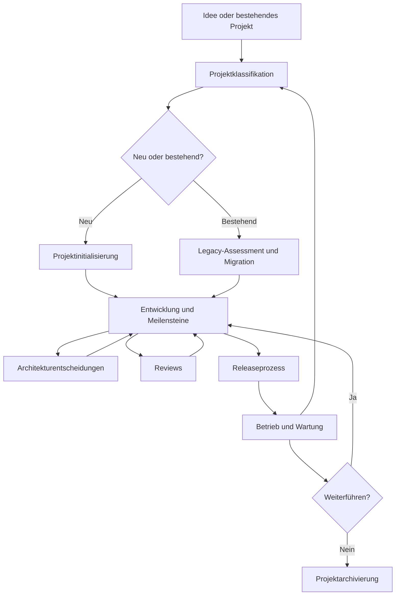

# Prozesslandkarte Version 1.0

## Zweck

Diese Landkarte zeigt das Zusammenspiel der operativen Prozesse. Die Abläufe sind iterativ und dürfen je nach Projekt zusammengeführt werden.

## Prozessverantwortung

| Prozess | Primäre Entscheidung | Typische Nachweise |
|---|---|---|
| Projektklassifikation | Welche Stufe und Profile gelten? | Klassifikationsnachweis, Risikomerkmale |
| Projektinitialisierung | Ist das Projekt bereit für den ersten Meilenstein? | Projektbrief, Readiness Gate |
| ADR-Prozess | Welche langfristige technische Option wird gewählt? | ADR, ADR-Index, Folgemaßnahmen |
| Reviewprozess | Ist ein Artefakt oder Änderungsstand ausreichend geprüft? | Findings, Verifikation, Freigabe |
| Legacy-Migration | Wie wird ein bestehendes Projekt sicher angeglichen? | Assessment, Backlog, Wellenplan |
| Releaseprozess | Darf der geprüfte Stand veröffentlicht werden? | Artefakte, Release Record, Verifikation |
| Projektarchivierung | Ist die Stilllegung vollständig und verantwortbar? | Archivierungsnachweis, Restpflichten |

## Skalierung

Einzelentwickler dürfen Rollen kombinieren und Artefakte zusammenführen. Nicht zusammengeführt werden dürfen jedoch:

- Entscheidung und ihre Begründung,
- offenes Risiko und genehmigte Ausnahme,
- geprüfter Stand und später veränderter Stand,
- Releaseartefakt und nicht geprüfter lokaler Build,
- Archivierungsstatus und weiterhin aktive Restpflichten.

## Pilotanwendung

Für die ersten SASD-Pilotprojekte empfiehlt sich folgende Reihenfolge:

1. bestehendes Projekt klassifizieren,
2. Legacy-Assessment erstellen,
3. einen kleinen Migrationsmeilenstein planen,
4. ADRs für strukturelle Änderungen schreiben,
5. Änderung reviewen,
6. Releaseprozess anwenden,
7. Erfahrungen im Reviewnachweis festhalten.
